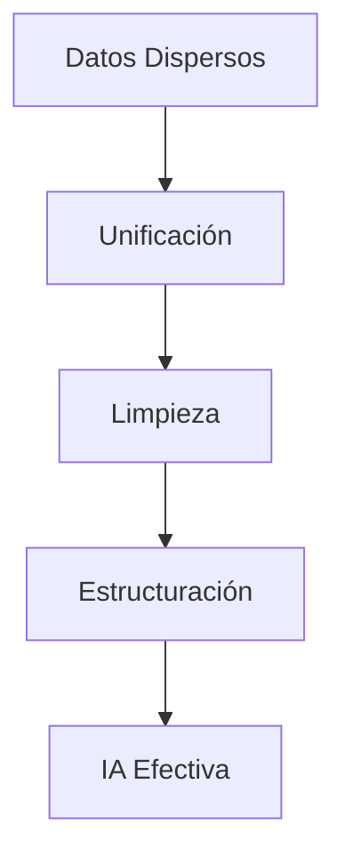

# Automatización con IA: Más Allá de la Eficiencia

La **inteligencia artificial** ya no es solo una herramienta para hacer las cosas más rápido. Las empresas que están ganando terreno la utilizan para crear **nuevas fuentes de valor** y **ventajas competitivas** que antes eran imposibles de imaginar.

## El Paradigma ha Cambiado

Durante años, la automatización se enfocó en **replicar tareas humanas** de forma más eficiente. Pero la IA moderna va mucho más allá:

- **Detección de patrones** que los humanos no pueden ver
- **Personalización masiva** en tiempo real
- **Predicción de comportamientos** futuros
- **Optimización continua** de procesos complejos

### Casos Reales de Transformación

#### 1. E-commerce Inteligente

> Una tienda online implementó IA que no solo recomienda productos, sino que **predice qué va a querer comprar** el cliente antes de que él mismo lo sepa.

**Resultado:** 40% de aumento en ventas cruzadas.

#### 2. Manufactura Predictiva

Una fábrica usa sensores IoT + IA para predecir fallas en maquinaria **3 semanas antes** de que ocurran.

**Impacto:** 
- 60% reducción en downtime
- $2M ahorrados en costos de reparación
- Optimización de inventario de repuestos

## Framework para Implementar IA Estratégica

### Paso 1: Identifica Oportunidades de Valor

No automatices por automatizar. Busca:

1. **Procesos con alta variabilidad** humana
2. **Decisiones que requieren múltiples variables**
3. **Patrones ocultos** en tus datos
4. **Experiencias personalizables** a escala

### Paso 2: Empieza con Datos Limpios

### Paso 3: Implementación Progresiva

| Fase | Objetivo | Tiempo |
|------|----------|---------|
| **Piloto** | Probar concepto | 1-2 meses |
| **MVP** | Valor medible | 3-4 meses |
| **Escala** | Adopción masiva | 6-12 meses |

## Errores Comunes que Debes Evitar

### ❌ "IA por IA"
No implementes tecnología sin un **objetivo de negocio claro**.

### ❌ Datos de Mala Calidad
La IA amplifica tanto los aciertos como los errores de tus datos.

### ❌ Falta de Change Management
El 70% de proyectos de IA fallan por **resistencia organizacional**, no por tecnología.

## El Futuro Es Ahora

Las empresas que esperan a que la IA sea "más madura" ya están **2 años atrás**. La ventaja competitiva no viene de tener la mejor tecnología, sino de:

1. **Entender** cómo crear valor con IA
2. **Ejecutar** implementaciones estratégicas
3. **Iterar** basándose en resultados reales

---

### ¿Quieres implementar IA en tu empresa?

La diferencia entre automatizar tareas y crear valor estratégico está en el **enfoque**. 

Si estás listo para explorar cómo la IA puede transformar tu negocio más allá de la eficiencia, [conversemos](mailto:contacto@andrelahud.com).

**¿Qué procesos en tu empresa podrían beneficiarse de IA estratégica? Comparte tu experiencia en los comentarios.**